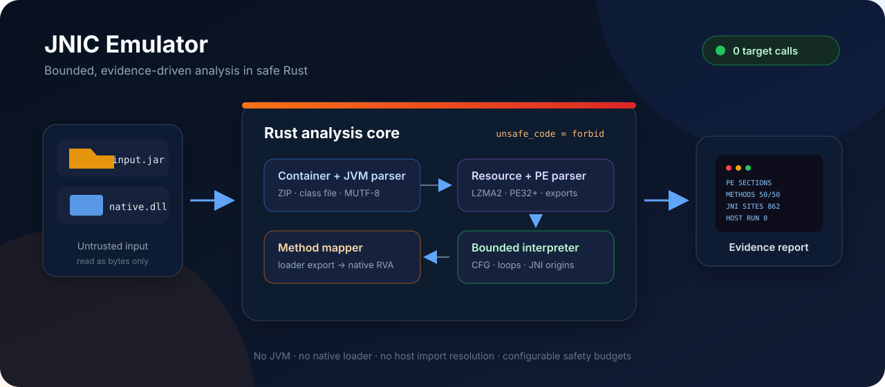
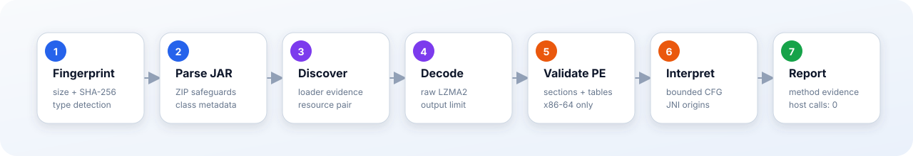
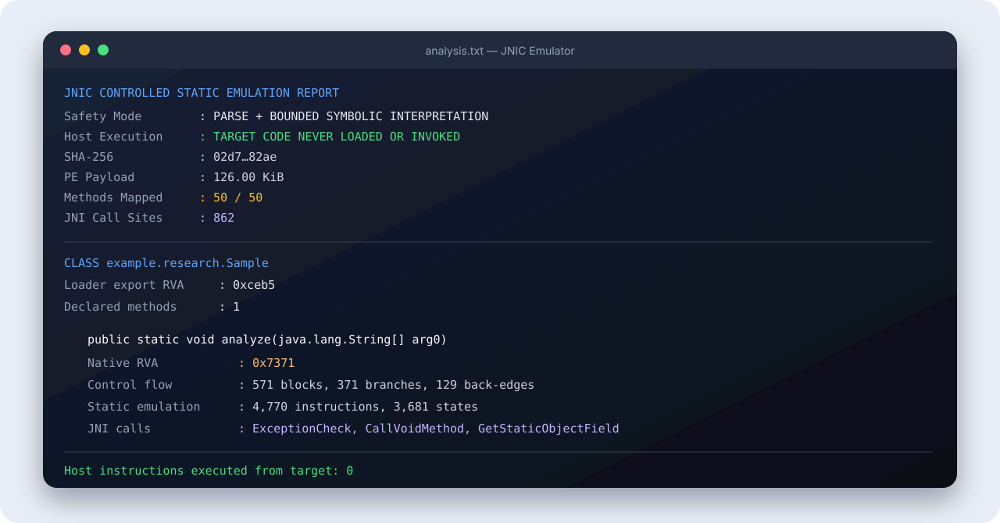

# JNIC Emulator



[](https://www.rust-lang.org/)
[](LICENSE)
[](src/lib.rs)

JNIC Emulator is a source-only Rust research tool for inspecting JNIC-protected Java archives and their embedded Windows x86-64 payloads. It discovers the loader/resource pair, parses Java class metadata, decodes the PE image, maps protected methods, and performs bounded control-flow interpretation without loading or invoking target machine code.

Created and maintained by **malidev**.

> [!IMPORTANT]
> This project is intended only for lawful security research, education, interoperability, and defensive analysis. Analyze only software you own or are explicitly authorized to inspect. Malicious use is prohibited by the project license.

The project is independent and is not affiliated with, endorsed by, or sponsored by any third-party product, project, or vendor.

## What it does

- Reads JAR/ZIP members with path, size, CRC, and decompression safeguards.
- Parses JVM class files and modified UTF-8 without starting a JVM.
- Finds the loader and `.dat` resource from class/archive evidence instead of a target-specific path or identifier.
- Decodes raw LZMA2 resources entirely in memory under a configurable limit.
- Locates and validates an embedded PE32+ x86-64 image.
- Parses PE sections, exports, imports, exception-directory function boundaries, and image metadata.
- Maps loader exports to native Java methods through registration-stub analysis.
- Decodes x86-64 instructions as inert bytes and explores bounded control-flow states.
- Tracks `JNIEnv` origins and resolves recognized indirect calls through the public JNI function-table ABI.
- Produces a deterministic, human-readable report with SHA-256 provenance.

It does **not** start Java, call `DllMain`, call `JNI_OnLoad`, resolve host imports, map the PE as executable memory, or invoke any instruction from the target.

## Processing pipeline



1. The input is size-checked and hashed.
2. JAR entries and Java class files are parsed as data.
3. Loader/resource evidence is cross-checked; ambiguous pairs are rejected.
4. The raw LZMA2 stream is decoded under a strict output limit.
5. The embedded PE32+ image is validated and its metadata tables are read.
6. Native methods are mapped, decoded, and explored with bounded state counts.
7. A text report is written. Target instructions executed on the host: **zero**.

## Requirements

- Rust 1.85 or newer
- Cargo
- Linux, macOS, or Windows host

All runtime parsing and decoding dependencies are Rust crates. No copied DLL, prebuilt analyzer, Java installation, Capstone installation, or Unicorn installation is required.

## Build

```bash
git clone https://github.com/malithedeveloper/JNIC-Emulator.git
cd JNIC-Emulator
cargo build --release
```

The executable will be at:

- Linux/macOS: `target/release/jnic-emulator`
- Windows: `target\release\jnic-emulator.exe`

## Usage

Analyze a JNIC-protected archive:

```bash
jnic-emulator analyze input.jar --output analysis.txt
```

Inspect a raw Windows x86-64 payload:

```bash
jnic-emulator analyze native.dll --output pe-analysis.txt
```

Run deterministic internal checks:

```bash
jnic-emulator self-test
```

During analysis, the terminal explicitly confirms the safety model:

```text
[*] Parsing input as inert data: input.jar
[*] Target machine code will not be loaded or invoked.
[+] Report written: analysis.txt
[+] Classes: 31 | Methods: 50 | Mapped: 50 | Warnings: 0
```

### Resource limits

Every large allocation or traversal has a defensive bound. Defaults can be changed for an unusually large research sample:

| Option | Default | Meaning |
| --- | ---: | --- |
| `--max-input-mib` | 1024 | Largest accepted input file |
| `--max-entry-mib` | 512 | Largest uncompressed JAR member |
| `--max-decoded-mib` | 1024 | Largest decoded native resource |
| `--max-method-instructions` | 250,000 | Decode budget per native method |
| `--max-path-states` | 25,000 | Control-flow state budget per native method |

Example:

```bash
jnic-emulator analyze input.jar \
  --output analysis.txt \
  --max-input-mib 256 \
  --max-decoded-mib 512 \
  --max-path-states 10000
```

Do not raise limits for untrusted samples unless the analysis environment has enough memory and CPU capacity.

## Understanding the report



The report is split into four evidence layers:

### 1. Input provenance and safety state

The header records input type, byte size, SHA-256, loader class, resource name, decoded size, PE base, and entry point. The entry point is metadata and is never called.

### 2. PE metadata

The section list shows which ranges are executable in the target image. “Executable” describes PE flags only; the bytes remain ordinary data in this process. Imports are names and IAT offsets only. They are never resolved against host libraries.

### 3. Java-to-native mapping

For each protected class, the report displays its loader export, declared native method count, and discovered registration targets. Each method includes its Java declaration and mapped native RVA.

### 4. Bounded static emulation

For every mapped function, the engine reports:

- decoded instruction and basic-block counts;
- conditional branches and backward-edge loop candidates;
- explored control-flow states and whether a safety limit was reached;
- direct and indirect call counts;
- recognized JNI functions and their call-site RVAs.

These are conservative observations, not reconstructed original source code. Optimizations, obfuscation, unusual calling conventions, incomplete PE unwind metadata, or newer protection layouts can reduce precision.

## Architecture

```text
src/
├── main.rs        CLI, limit validation, report writing
├── analyzer.rs    pipeline orchestration and Java/native mapping
├── archive.rs     bounded ZIP/JAR and raw LZMA2 handling
├── classfile.rs   JVM class-file and modified UTF-8 parser
├── descriptor.rs  Java type/method descriptor parser
├── pe.rs          PE32+ parser and registration target scanner
├── emulator.rs    bounded x86 control-flow and JNIEnv-origin tracing
├── jni.rs         public JNI ABI slot names
├── report.rs      deterministic evidence report renderer
├── limits.rs      centralized defensive defaults
└── lib.rs         public library surface and safety contract
```

The crate has `unsafe_code = "forbid"`. Parsing helpers use checked offsets and integer conversions; malformed or ambiguous data returns an error instead of selecting a guessed payload.

## Tests and quality checks

```bash
cargo fmt --check
cargo clippy --all-targets --all-features -- -D warnings
cargo test --all-features
cargo run -- self-test
```

The test suite covers descriptor validation, modified UTF-8, bounded writers, JNI ABI slots, loader-export decoding, report units, and parser truncation behavior. Real samples are deliberately not distributed in this repository.

## Supported scope

Currently supported:

- standard ZIP/JAR containers;
- JVM class files using current constant-pool tags;
- raw LZMA2 native resource streams;
- embedded or standalone Windows PE32+ x86-64 images;
- native method mapping through the loader-export/registration pattern;
- x86-64 static control flow and JNI table-call recognition.

Known limitations:

- ARM64 payloads are not decoded.
- ZIP64-specific layouts and encrypted members are intentionally outside the core workflow.
- Exact high-level decompilation is not attempted.
- Self-modifying code, runtime-generated registration, and environment-dependent paths may not be visible statically.
- Raw DLL input lacks Java class metadata, so method names cannot be mapped.

## Research ethics and license

The [JNIC Emulator Research and Attribution License 1.0](LICENSE) permits lawful research, education, interoperability, and defensive analysis. It requires prominent attribution to **malidev** and a link to this repository in copies, derivatives, publications, or tools that use this work. It prohibits malicious activity and unauthorized analysis or access.

This is a source-available research license, not an OSI-approved open-source license. Review it before using or redistributing the project.

For academic or technical work, use the metadata in [`CITATION.cff`](CITATION.cff). A concise acknowledgement is:

```text
JNIC Emulator by malidev — https://github.com/malithedeveloper/JNIC-Emulator
```

## Responsible disclosure

Do not submit real customer archives, private payloads, credentials, or proprietary analysis reports to public issues. For a parser bug, provide the smallest synthetic reproduction you can legally share. Security issues should follow [`SECURITY.md`](SECURITY.md).
